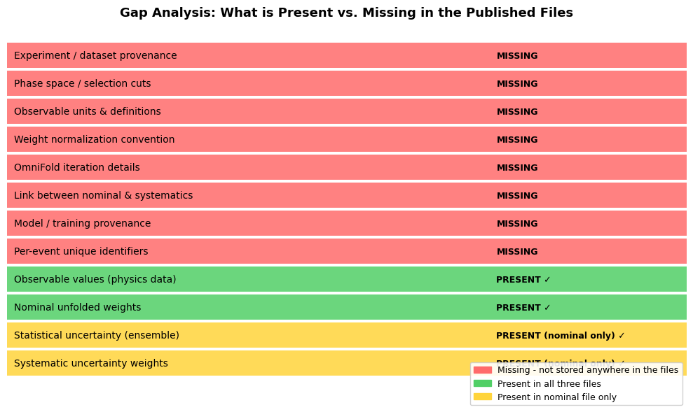

# Task 1 – Exploration and Gap Analysis

**Objective:** Load and inspect the three pre-calculated OmniFold weight files, classify their contents, identify what information is missing for reuse, and assess standardization challenges.

**Files (from `files/pseudodata/`):**

| File | Description |
|------|-------------|
| `multifold.h5` | Nominal result - MG5 simulation |
| `multifold_sherpa.h5` | Systematic: alternative generator (Sherpa) |
| `multifold_nonDY.h5` | Systematic: alternative sample composition (non-DY) |

---

## Column Classification

The three files share a common structure. Every file contains the **same 24 observable columns** and at least a `nominal_weight` and an `mc_weight`. The nominal file is the richest, with 200 columns total. Classification is performed automatically via `classify_columns()`.

### Summary across all files

|                      | Events  | Total cols | Observables | Nominal weight | MC weight | NN ensemble | MC bootstrap | Data bootstrap | Systematics | Metadata |
|----------------------|---------|------------|-------------|----------------|-----------|-------------|--------------|----------------|-------------|----------|
| nominal (MG5)        | 418,014 | 200        | 24          | 1              | 1         | 100         | 25           | 25             | 23          | 1        |
| systematic (Sherpa)  | 326,430 | 51         | 24          | 1              | 1         | 0           | 25           | 0              | 0           | 0        |
| systematic (nonDY)   | 433,397 | 26         | 24          | 1              | 1         | 0           | 0            | 0              | 0           | 0        |

---

## Gap Analysis Document

### Q1. What columns are present, and which are weights vs. observables vs. metadata?

#### Observables (24 columns - same in all three files)

These are the physics quantities measured per event, stored as `float32` (continuous) or `int32` (counts):

| Column(s) | Physics meaning | Type |
|-----------|-----------------|------|
| `pT_ll` | Transverse momentum of the Z boson (lepton pair system), GeV | float32 |
| `pT_l1`, `pT_l2` | Transverse momentum of leading and sub-leading lepton | float32 |
| `eta_l1`, `eta_l2` | Pseudorapidity of each lepton (−2.4 to 2.4) | float32 |
| `phi_l1`, `phi_l2` | Azimuthal angle of each lepton (−π to π, radians) | float32 |
| `y_ll` | Rapidity of the Z boson | float32 |
| `pT_trackj1/2` | Transverse momentum of leading / sub-leading track-jet | float32 |
| `y_trackj1/2` | Rapidity of each track-jet | float32 |
| `phi_trackj1/2` | Azimuthal angle of each track-jet | float32 |
| `m_trackj1/2` | Invariant mass of each track-jet, GeV | float32 |
| `tau1/2/3_trackj1/2` | N-subjettiness variables (jet shape) for each jet | float32 |
| `Ntracks_trackj1/2` | Number of charged tracks in each jet | **int32** |

#### Weights (vary by file)

| Category | Column(s) | Count | Present in |
|----------|-----------|-------|-----------|
| **nominal_weight** | `weights_nominal` | 1 | All 3 files |
| **mc_weight** | `weight_mc` | 1 | All 3 files |
| **nn_ensemble** | `weights_ensemble_0..99` | 100 | Nominal only |
| **bootstrap_mc** | `weights_bootstrap_mc_0..24` | 25 | Nominal + Sherpa |
| **bootstrap_data** | `weights_bootstrap_data_0..24` | 25 | Nominal only |
| **systematics** | `weights_dd`, `weights_pileup`, `weights_muEff*`, `weights_muCal*`, `weights_track*`, `weights_theory*`, `weights_topBackground`, `weights_lumi` | 23 | Nominal only |

#### Metadata (1 column - nominal only)

| Column | Role |
|--------|------|
| `target_dd` | Data-driven reweighting target flag |

Beyond `target_dd`, there is no other metadata. The row index (`axis1` in the HDF5 file) is a plain integer, and the file-level HDF5 attributes only contain PyTables version bookkeeping. No event IDs, run numbers, or dataset labels are stored.

---

### Q2. What information would a physicist need to reuse these weights that is not currently present?

The following critical information is **absent** from the files:

#### (a) No experiment or dataset provenance
- Which experiment produced this? (ATLAS, CMS, …)
- Which data-taking period / luminosity? (e.g. Run 2, 139 fb⁻¹)
- Which Monte Carlo generator and version? (MG5 vs Sherpa is implied by the filename, but not stored)
- Which process? (Z+jets is implied, not stated)

#### (b) No phase space / selection cuts
- What event selection was applied? (pT thresholds, eta cuts, jet multiplicity requirements)
- Are these particle-level or detector-level observables?
- What are the valid ranges for each observable? (e.g., "pT_ll > 200 GeV")
- Without this, applying the weights to a different sample in a different phase space will give wrong results silently.

#### (c) No observable definitions
- Units are missing (GeV assumed but not stated)
- No description of what `tau1/tau2/tau3` mean or how they are computed
- No reference to the jet algorithm, radius parameter, or track selection used to build `trackj1/trackj2`

#### (d) No weight normalization convention
- Are weights absolute (cross-section × luminosity) or relative (sum to 1)?
- The mean `weights_nominal ≈ 0.0043` suggests they are normalized, but to what?
- How should a user normalize when computing a new histogram?

#### (e) No iteration structure documentation
- OmniFold is iterative - how many iterations were run?
- Which iteration do `weights_nominal` come from?
- What convergence criterion was used?

#### (f) No link between the three files
- The three files are standalone. There is no field indicating that `multifold_sherpa.h5` is a systematic variation of `multifold.h5`.
- No field says "this is the Sherpa generator systematic" - that information lives only in the filename.

#### (g) No model/training provenance
- What neural network architecture was used?
- What features were used as inputs to the network?
- What hyperparameters (learning rate, epochs, batch size)?
- No model checkpoint is referenced.

#### (h) No event identifier
- There is no event ID or run/event number that would allow matching rows across the three files or back to the original data.

---

### Q3. What challenges do you anticipate in standardizing this output across experiments?

#### (a) Structural heterogeneity between analyses
Even within these three files from the same analysis, the column sets differ significantly (200 vs. 51 vs. 26 columns). Different analyses will store different sets of systematics, different numbers of ensemble members, and different observables. A rigid schema will be too restrictive; a flexible one will be hard to validate.

#### (b) Weight normalization conventions vary
Some analyses normalize weights to luminosity (absolute cross-section), others to unity, others to the number of MC events. Without a universal convention, users loading weights from HEPData may produce plots that are off by orders of magnitude.

#### (c) File sizes are prohibitive for HEPData
`multifold.h5` is ~498 MB; `target.h5` is ~2.7 GB. HEPData has file size limits and is not designed for binary array data at this scale. A strategy is needed (e.g., store only `weights_nominal` on HEPData and host full files on Zenodo/CERN Open Data with a pointer).

#### (d) Observable definitions are not universal
`pT`, `eta`, `phi` are standard, but jet substructure variables (`tau1`, `tau2`, `tau3`) depend on the specific algorithm, jet radius, and track selection - all of which differ between ATLAS and CMS. There is no common ontology for these quantities in the HEP community.

#### (e) Systematic uncertainty labeling is analysis-specific
The column `weights_pileup` makes sense for ATLAS Run 2, but a CMS analysis or a future HL-LHC analysis will have entirely different systematic sources with different names. Standardizing the naming convention without being too prescriptive is a difficult balance.

#### (f) Reproducibility requires the full software stack
Rerunning OmniFold from scratch requires the same version of the omnifold package, the same training data, the same random seeds, and the same preprocessing. None of this is captured in these files. Bit-for-bit reproducibility across years is very difficult without containerization (Docker/Singularity) and archived environments.

#### (g) Long-term format stability
PyTables HDF5 with `pandas_version: 0.15.2` is already outdated. Reading these files with future versions of pandas may require compatibility shims. A more stable interchange format (e.g., Apache Parquet, or a well-defined HDF5 schema without PyTables conventions) would be preferable for 10+ year archival.

---

## Visual Summary of Missing Metadata

---

## Summary

| Question | Key Finding |
|----------|------------|
| **What columns are present?** | 24 physics observables (kinematics + jet substructure) + up to 176 weight/metadata columns (nominal, mc, ensemble, bootstrap, systematics, metadata) - classified automatically via `classify_columns()` |
| **Which are weights vs. observables vs. metadata?** | Observables: `pT_*`, `eta_*`, `phi_*`, `y_*`, `m_*`, `tau*`, `Ntracks_*` - Weights: `weights_nominal`, `weight_mc`, `weights_ensemble_*`, `weights_bootstrap_*`, plus 23 systematics - Metadata: `target_dd` |
| **What is missing for reuse?** | Experiment identity, phase space cuts, observable units, weight normalization, iteration details, file linkage, model provenance, event IDs |
| **Standardization challenges?** | Structural heterogeneity, normalization conventions, file sizes, non-universal observable definitions, analysis-specific systematic naming, software reproducibility, long-term format stability |
